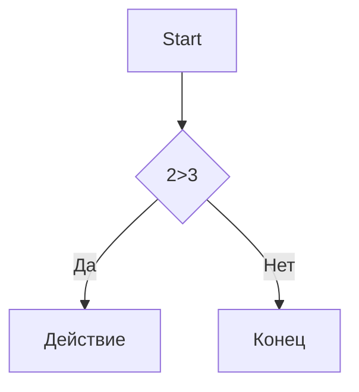

# Заголовок 1
## Заголовок 2
### Заголовок 3
#### Заголовок 4
##### Заголовок 5
###### Заголовок 6

Выделение текста
-----------------

*Курсив* / _Курсив_

**Жирный** / __Жирный__

***Жирный и курсив*** / ___Жирный и курсив___

~~зачёркнутый~~

`моноширинный код`

Списки
-----------------

- Пункт 1
- Пункт 2
  - Вложенный
  - ещё
* Пункт 3
+ Пункт 4

1. Первый
2. Второй
3. Третий
  1. Вложенный
  2. ещё

- [x] 1
- [ ] 2
- [ ] 3

Ссылки
-----------------

[текст ссылк](https://google.com)

[С подсказкой](https://google.com "При наведении")

<https://auto-link.com>

[Ссылочный стиль][1]

[1]: https://ya.ru

Картинки
-----------------


[](https://static.vecteezy.com/system/resources/previews/016/833/880/non_2x/github-logo-git-hub-icon-with-text-on-white-background-free-vector.jpg)

Цитата
-----------------

>Цитата
>
>Много строк
>
>>Вложенная

Код
-----------------

```markdown
print("Hello") Python
```

```python
c=a+b
print(f"{c} - {a} + {b}")
```

Таблицы
-----------------

---: = ориентация справа

:---: ориентация по центру

:--- = ориентация слева

| Name | Age | City |
|-----:|:---:|:-----|
|SS    |34   | MOd  |
|SS    |34   | MOd  |
|SS    |34   | MOd  |
|SS    |34   | MOd  |
|SS    |34   | MOd  |
|SS    |34   | MOd  |

Линии
-----------------

-----

---
***

___

Экранирование
-----------------

\# fdf

\[ dsdssd ]\

Диаграмма
-----------------


Заголовки
-----------------

- [Заголовки](#1-заголовки)
- [Списки](#3-списки)
